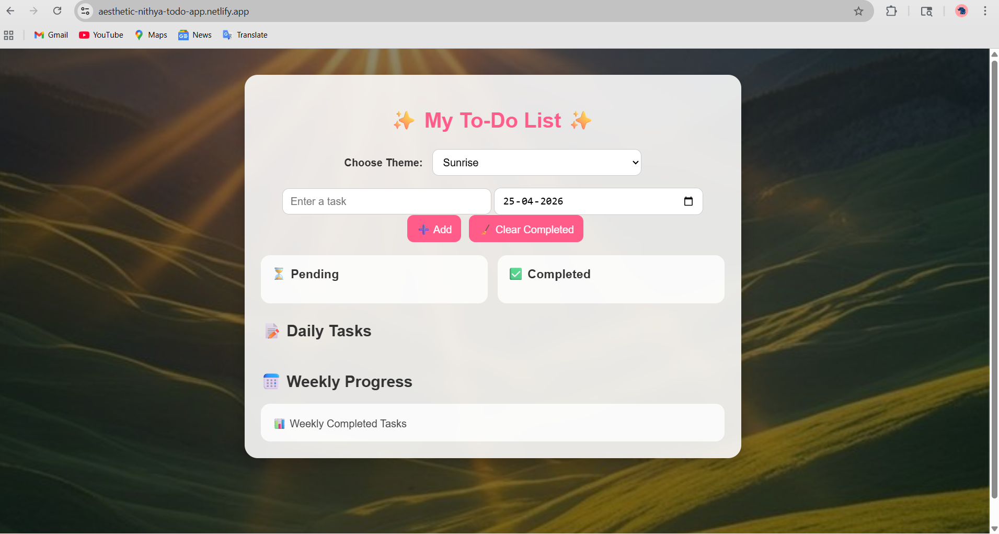

# ✨ Aesthetic To-Do List

A beautifully designed To-Do List web application with theme customization, date-wise task management, and weekly progress tracking.

## 🌐 Live Demo
👉 https://aesthetic-nithya-todo-app.netlify.app

---

## 🚀 Features

- 📝 Add, edit, and delete tasks  
- ✅ Mark tasks as completed / pending  
- 🧹 Clear completed tasks  
- 📅 Date-wise task organization  
- 📊 Weekly progress tracking (Day vs Tasks Done)  
- 🎨 Aesthetic theme customization (background images)  
- 💾 Data stored using LocalStorage (no data loss on refresh)  

---

## 🛠️ Technologies Used

- HTML  
- CSS  
- JavaScript  
- LocalStorage  
- Netlify (Deployment)  

---

## 📸 Project Structure

## 📌 Status
This project is completed and deployed successfully.

## 📸 Screenshot

## ✨ Key Highlights
- Clean and responsive UI
- Beginner-friendly JavaScript project
- Deployed using Netlify

